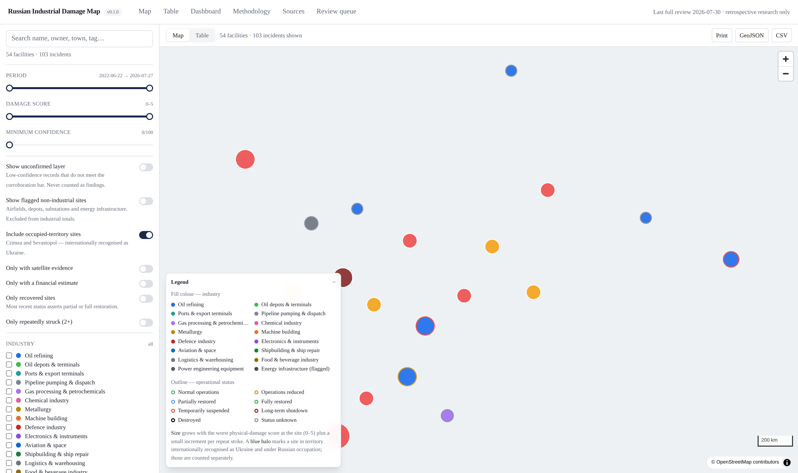

# Russian Industrial Damage Map

An OSINT research database and interactive map of **industrial facilities in the
Russian Federation reported physically damaged during the war against Ukraine
since 24 February 2022.**

The project is retrospective and documentary. It uses open sources only, it
records what is established separately from what is not, and it attaches a
confidence score and a source list to every claim it makes.

> **This is not a live tracker.** Nothing is published until at least 72 hours
> after the event, and nothing is published until a person has approved it.
> See [SECURITY_AND_ETHICS.md](./SECURITY_AND_ETHICS.md) for what the project
> deliberately does not contain.

---

## Run it

```bash
cp .env.example .env
docker compose up --build
```

Then open <http://localhost:3000>.

Compose brings up three services: PostgreSQL 16 + PostGIS 3.4, a one-shot
migration/seed job, and the web application. The seed runs the quality-control
engine first and **refuses to load a dataset that has any error-severity
finding**, so the database can never hold records the editorial rules reject.

<details>
<summary>Behind a TLS-intercepting proxy?</summary>

Drop the proxy's root certificate at `docker/certs/ca.crt` and pass the proxy
through to the build:

```bash
docker compose build \
  --build-arg HTTP_PROXY="$HTTP_PROXY" \
  --build-arg HTTPS_PROXY="$HTTPS_PROXY" \
  --build-arg NO_PROXY="$NO_PROXY"
docker compose up
```
</details>

### Without Docker

```bash
npm install
npm run dev            # http://localhost:3000
```

`DATA_BACKEND=auto` (the default) serves from the version-controlled dataset in
`./data` when Postgres is unreachable, so the app works before any container
exists. `GET /api/health` reports which backend is actually in use.

---

## What is in it

| | |
|---|---|
| Facilities | **64** — 62 industrial enterprises + 2 flagged non-industrial sites |
| Incidents | **117** — 105 published, 12 held in the unconfirmed layer |
| Sources | **194** — 11 tier A, 91 tier B, 92 tier C |
| Period covered | 22 June 2022 → 27 July 2026 |
| Regions | 32 federal subjects, plus occupied Crimea and Sevastopol as a separate layer |
| Claims, status changes, estimates, imagery | 31 / 47 / 7 / 6 |
| Review queue | 10 candidates, none published |

Industry spread: oil refining 24, logistics & warehousing 9, ports & export
terminals 5, chemicals 5, machine building 4, oil depots 3, gas processing 2,
electronics 2, defence industry 2, shipbuilding 2, food industry 2,
metallurgy 1, pipeline nodes 1, plus 2 flagged energy-infrastructure records.

**The dataset is an incomplete sample, not a census.** Read
[the limitations section](./METHODOLOGY.md#13-known-limitations) before quoting
any number from it.

---

## Screens

| | |
|---|---|
| `/` | Map: clustering, colour by industry, outline by status, size by damage score, time slider, 12 filters, legend, map/table toggle |
| `/table` | Every incident in one table, newest first, with inline source links |
| `/facility/[slug]` | Full facility record: identification, incident history, status timeline, financial estimates with assumptions, imagery, sources, and separate "what is established" / "what remains unresolved" blocks |
| `/dashboard` | Analytics. Attested and modelled financial totals are reported **separately and never summed** |
| `/methodology` | Inclusion criteria, source hierarchy, verification, damage scale, confidence bands, QC rules, limitations |
| `/sources` | The full source register grouped by tier |
| `/review-queue` | Candidate incidents awaiting manual review — explicitly not published data |



More screenshots in [`screenshots/`](./screenshots).

---

## API and exports

| Route | Purpose |
|---|---|
| `GET /api/facilities?format=geojson\|json` | Filtered records; invalid filters return `400`, never a silent default |
| `GET /api/facility/[slug]` | One facility with incidents, status history, estimates, media, claims, sources |
| `GET /api/facility/[slug]/report` | Self-contained printable HTML → "print to PDF" |
| `GET /api/analytics` | Dashboard figures |
| `GET /api/qc` | The project's own quality-control report, live |
| `GET /api/health` | Effective data backend |
| `GET /api/export/{facilities,incidents,sources}.csv` | CSV with a provenance preamble |
| `GET /api/export/dataset.json`, `/api/export/geojson` | Full JSON / GeoJSON |
| `POST /api/ingest/run` | Candidate discovery. Writes nothing, publishes nothing. Requires `INGEST_SECRET` |

Every export carries dataset version, last review date, licence, a methodology
link and the confidence warning — a CSV that escapes into a spreadsheet without
them is how OSINT data gets laundered into false certainty.

---

## Repository layout

```
data/                    The dataset — the source of truth for content
  types.ts               Domain model
  reference.ts           Industries, regions
  sources.ts             Source register (194 items, tiered)
  facilities/*.ts        Facilities, incidents, status, estimates, media, claims
  review-queue.ts        Unpublished candidates
  duplicate-resolutions.ts  Closed duplicate-candidate decisions
db/                      PostGIS DDL, Drizzle schema, migrate + seed
lib/                     Zod schemas, QC engine, read model, filters, FX, exports
app/                     Next.js App Router — pages and API routes
components/              Map, filters, legend, facility card, charts, UI primitives
ingest/                  Feed/CSV readers, name matching, intake pipeline
tests/unit/              71 Vitest tests
tests/e2e/               22 Playwright tests
docs/                    Deployment, backup, editorial runbooks, imagery
screenshots/             UI captures
```

---

## Commands

```bash
npm run dev          # development server
npm run build        # production build
npm run qc           # quality-control report (exit 1 on any error)
npm test             # unit tests
npm run test:e2e     # end-to-end tests
npm run typecheck    # tsc --noEmit
npm run db:migrate   # apply SQL migrations
npm run db:seed      # load ./data into Postgres (QC-gated)
npm run ingest:demo  # candidate discovery against a bundled demo input
```

---

## Stack

Next.js 15 · TypeScript · PostgreSQL 16 + PostGIS 3.4 · Drizzle ORM · MapLibre
GL JS with OpenStreetMap raster tiles · Tailwind CSS · shadcn/ui-compatible
primitives on Radix · Zod · Vitest · Playwright · Docker Compose.

No Google Maps dependency and no mapping API key: the basemap style is built
locally from OSM raster tiles. Point `NEXT_PUBLIC_BASEMAP_STYLE_URL` at your own
vector style to replace it.

Two deliberate departures from the original stack sketch, both recorded in
[DECISIONS.md](./DECISIONS.md): React Query was dropped in favour of Next.js
server components with client-side filtering (the payload is small enough that a
fetch layer added nothing), and charts are hand-rolled SVG/CSS rather than a
charting library, so every figure stays readable as text and prints correctly.

---

## Documentation

- [METHODOLOGY.md](./METHODOLOGY.md) — inclusion, verification, scoring, limits
- [DATA_DICTIONARY.md](./DATA_DICTIONARY.md) — every field, every enum
- [SOURCES_POLICY.md](./SOURCES_POLICY.md) — tiers, syndication, archiving
- [SECURITY_AND_ETHICS.md](./SECURITY_AND_ETHICS.md) — what is excluded and why
- [CONTRIBUTING.md](./CONTRIBUTING.md) — how to propose a change
- [CHANGELOG.md](./CHANGELOG.md)
- [docs/DEPLOYMENT.md](./docs/DEPLOYMENT.md), [docs/BACKUP.md](./docs/BACKUP.md)
- [docs/ADDING_A_FACILITY.md](./docs/ADDING_A_FACILITY.md), [docs/CORRECTING_A_RECORD.md](./docs/CORRECTING_A_RECORD.md)
- [docs/SATELLITE_IMAGERY.md](./docs/SATELLITE_IMAGERY.md)

## Licence

Dataset: **CC BY 4.0**. Code: MIT. Source articles and imagery remain the
property of their publishers; this repository stores links and metadata, never
rehosted copies of restricted material.
